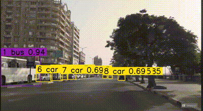

# vehicle-tracking-system

development of an advanced vehicle tracking system that efficiently tracks, counts, and detects vehicles on the road. The system utilizes a combination of the ByteTrack algorithm, the supervision library, and the YOLO v8 algorithm to achieve its goals.


##  The main components I used  
- ByteTrack Algorithm:

		The ByteTrack algorithm for object tracking within the system. It not only tracks objects but also discerns their direction of movement, making it possible to identify if a vehicle is travelling  in the 
     incoming or outgoing direction.
		
- Supervision Library:
used I  observing vehicles that cross a designated boundary line. It can differentiate between the inward and outward movements of vehicles, ensuring accurate monitoring of their movements with respect to the set boundary, and its rule in the future if we need to count the objects based on their road.
		
		
- YOLO v8 Algorithm:
YOLO v8 takes on the responsibility of object detection in the system. It's known for its rapid detection speeds and high accuracy in identifying vehicles on the road. The upcoming system update is set to incorporate the advanced YOLO NAS version for enhanced processing speeds and even more precise detection.


### Inference on video

The video source utilized to test the tracking system was a video feed from Tahrir Street in Cairo, Egypt.



## Instructions on How to Run the System:
	

Clone this repository to your local machine.
```bash

 git clone https://github.com/alaaelawady/vehicle-tracking-system
```
Install all required dependencies.
```bash

 pip install -r requirements.txt 
```
Run the script with the following command, specifying the input and output video paths:
```bash
 python app.py 
```
### Resources

For more details on the Tracknet used, refer to the [ByteTrack](https://github.com/ifzhang/ByteTrack
).
[ultralytics](https://github.com/ultralytics/ultralytics).


 
